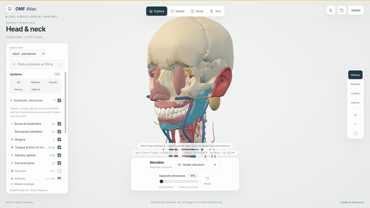
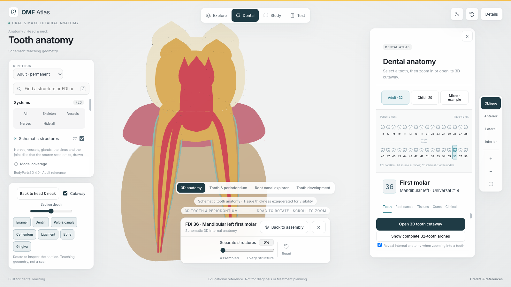
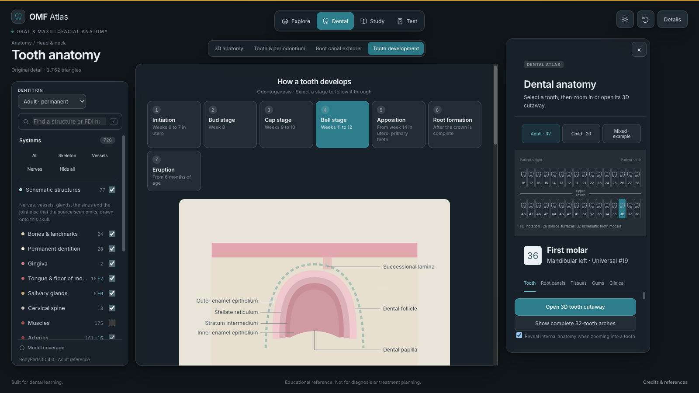

# OMF Atlas

**An interactive 3D atlas of oral and maxillofacial anatomy, for dental students, dentists, and dental specialists.**

**[Open the atlas at omfatlas.xera.ac](https://omfatlas.xera.ac)** · No account, no API key, no backend.



<sub>Two of the six scenes. [Watch the full 38 second tour](documentation/screenshots/tour.mp4).</sub>

Built on BodyParts3D geometry and inspired by [Human Atlas](https://github.com/ashemag/human-atlas), whose model-first studio interface this follows.

## What it contains

- **643 source meshes** from BodyParts3D 4.0, cropped to the head and neck, including 47 facial and masticatory muscles recovered from the 3.0 archive and registered onto the 4.0 base.
- **77 schematic structures** for the oral and maxillofacial anatomy the source dataset does not contain: the maxillary and mandibular divisions of the trigeminal nerve, the facial nerve, the external carotid tree, the parotid gland and its duct, the maxillary sinus, and the temporomandibular articular disc. [How that works, and why it was necessary](#schematic-anatomy).
- **Two published dental datasets**, redistributed as their authors modeled them rather than drawn: a synthetic lower jaw with cortical and cancellous bone, fourteen teeth and a ligament shell around every root, and an immature first permanent molar with its pulp cavity and the space maintainer built on it. [What they are and what they cannot show](#published-dental-models).
- **A 3D tooth cutaway** with enamel, dentin, pulp and canals, cementum, periodontal ligament, alveolar bone, and gingiva, on a movable section plane. Zooming into the gums opens the same cutaway framed on the periodontium.
- **A tooth development section**: the seven stages of odontogenesis, the germ layer origin of every dental tissue, the eruption chronology for both dentitions, and the anomalies that arise at each stage.
- Search, layer isolation, a separation control that lays the whole assembly out as a parts inventory, guided study notes, and a scored self-test.

|  |  |
| --- | --- |
|  |  |
| The tooth cutaway, sectioned | Tooth development, dark theme |

## Run

Node.js 22.13 or newer is required.

```sh
npm ci
npm run dev
```

Open http://127.0.0.1:3016. No accounts, API keys, or backend are required.

```sh
npm test
npm run build
npm run preview
```

The production site is written to `dist/` and can be served by a static host at its root. The app uses root-relative asset paths and loads no external resources at all: Inter is served from `public/fonts/`, which is what lets the site run behind a Content-Security-Policy whose `font-src` is `'self'`. `deploy/` holds the nginx vhost and the build script used for omfatlas.xera.ac.

## Feature detail

The summary above in full.

- Head-and-neck-only 3D explorer: 643 selectable source meshes across 14 layers, including 47 registered facial and masticatory muscles recovered from BodyParts3D 3.0.
- 77 schematic oral and maxillofacial structures for what the source dataset does not contain: the maxillary and mandibular divisions of the trigeminal nerve and their oral branches, the facial nerve and its five terminal branches, the external carotid artery and the facial, lingual, maxillary, inferior alveolar, superficial temporal, posterior superior alveolar and greater palatine arteries, the facial and retromandibular veins, the external jugular vein, the pterygoid plexus, the parotid gland with Stensen's duct, Wharton's duct, the maxillary sinus, and the temporomandibular articular disc. These are drawn, not segmented, and they are labeled as schematic wherever they are named. One switch turns the whole set off. See [schematic anatomy](#schematic-anatomy).
- A tooth development section covering the seven stages of odontogenesis with a labeled diagram for each, the germ layer origin of every dental tissue, the eruption chronology for both dentitions, and the developmental anomalies that arise at each stage.
- Original-archive surface detail loads on selection for 549 structures, including all 28 source teeth and the mandible/maxillae. Upgraded meshes have 2.61 times the aggregate triangle count of their optimized equivalents; this is source geometry, not synthetic subdivision.
- Light and dark themes, resolved before the first paint from the stored choice or the system setting, with a toggle in the top bar.
- A model-first studio interface inspired by Human Atlas, with floating layers, an always-visible desktop inspector (collapsible on mobile), search, opacity, separation, camera presets, zoom, and isolation. Selecting a part does not change the model viewport's desktop position or size.
- Adult/child selection changes the actual 3D teaching arches: 32 permanent, 20 primary, or a representative 24-tooth mixed dentition. Child teeth use different tissue proportions and root divergence, not a scaled adult skull.
- 32 permanent and 20 primary tooth reference entries, with FDI and Universal notation, eruption timing, primary shedding ranges, external morphology, and root patterns.
- Tooth-specific internal-anatomy notes, example canal arrangements, and an interactive explorer of all eight Vertucci configurations.
- Zoom into a selected tooth to open a rotatable 3D cutaway. Toggle enamel, dentin, pulp/root canals, cementum, periodontal ligament, alveolar bone, and gingiva; move the section plane or restore the external surfaces.
- Selecting a tooth does not recenter the head. Zoom out past the cutaway scale to return to the head or developmental arches; the explicit Back button does the same.
- Zoom stops at the normal 100% assembly before crossing into separation or close-up. Continued outward input separates intact tissue groups first, then arranges individual structures in tissue blocks: bones (including neck), muscles, teeth, then other tissues. The named list follows that ordering. Wheel/pinch has a 300 ms normal-view pause; separate toolbar clicks proceed on the next click. Zoom-out separation is deliberately slower than zoom-in; the Display controls slider also sets the arrangement directly.
- Deselect with the clear button, Escape, an empty-canvas click, or a second click on the selected structure.
- Additional labeled 2D tooth/periodontium diagrams include sulcus and junctional epithelium, plus a separate canal-configuration explorer.
- Periodontal anatomy, clinical study connections, learning-level notes, saved structures, guided study, and a scored self-test.
- In-app references and explicit model-coverage information.

## Published dental models
<a id="published-dental-models"></a>

Everything else in the 3D dental views is procedural teaching geometry built by
this project. These two are not. They are published datasets, both CC BY 4.0,
loaded as their authors modeled them, and the Source models view names the
authors, the licence and the limits on screen rather than only here.

**A synthetic lower jaw.** Diaz and colleagues (2024), Mendeley Data
[10.17632/xjsx7nfhj8.1](https://doi.org/10.17632/xjsx7nfhj8.1). Cortical and
cancellous alveolar bone, fourteen lower teeth, and a periodontal ligament for
each of them, in one assembly. Fading the bone shows every root in its socket
with its ligament. The source built that ligament by extruding 0.25 mm radially
around each root, so it is a shell of even thickness rather than a segmented
ligament, and its width is a modeling choice. The dataset carries no pulp, no
cementum, no gingiva and no nerve.

**An immature first permanent molar.** Kang (2024), figshare
[10.6084/m9.figshare.24591537.v1](https://doi.org/10.6084/m9.figshare.24591537.v1),
from Shi, Kang and Liu, PeerJ 12:e17456
([10.7717/peerj.17456](https://doi.org/10.7717/peerj.17456)). The outer surface
of the tooth, its pulp cavity, its ligament, and the band and loop space
maintainer built on it. The shape comes from the cone beam CT of a seven year
old in mixed dentition, so it is an immature tooth and not an adult standard
form, and its outer surface is not divided into enamel and dentin. The pulp
cavity is the cavity that was modeled, not pulp tissue: no apical foramen, no
lateral canals, no vessels, no nerve, and no canal length can be measured from
it. Its ligament thickness is given as 0.15 mm in the paper's methods and
0.2 mm in its discussion; the paper states both, so this does too.

Neither model is registered onto the head and neck assembly, because a position
on this skull is not something either dataset carries, and they are two
different jaws so they are never shown in one frame. `scripts/import-dental-models.mjs`
converts them and records the digest of every source file, the tessellation
settings, and the triangle count before and after simplification in
`public/models/dental/manifest.json`. Full terms are in
[public/models/dental/ATTRIBUTION.md](public/models/dental/ATTRIBUTION.md).

## Schematic anatomy
<a id="schematic-anatomy"></a>

BodyParts3D 4.0 is a whole-body dataset, and for the head it is mostly bone, muscle, brain, and orbit. Its complete nerve set is 55 concepts, all orbital: there is no maxillary or mandibular division of the trigeminal nerve, no facial nerve, and none of the lower cranial nerves. Its arteries in this region are the carotids and the intracranial tree; the external carotid artery and every branch that supplies the jaws are absent, as are the parotid gland, the facial vein, the paranasal sinuses, and the articular disc of the temporomandibular joint. For an oral and maxillofacial atlas those absences cover most of the subject, so `src/schematic-anatomy.js` builds those structures instead.

What keeps them honest is that no waypoint is a typed-in coordinate. Every course is fitted at run time to landmarks measured on this particular assembly: the root apices of the 28 source teeth give the arch and the alveolar heights, the mandible mesh gives the condyle, the gonial angle, the medial ramus surface at the mandibular foramen, and the buccal plate at the mental foramen; the maxilla, palatine bone, temporal bone, and carotid bifurcation supply the rest. The inferior alveolar nerve therefore runs under the apices of this skull's molars and leaves through a mental foramen found on this mandible's own surface.

They remain teaching geometry. Caliber and course are representative of typical anatomy, variation in these structures is common, and none of it is a segmentation of a scan. `tests/schematic-anatomy.test.mjs` asserts the anchoring rules rather than fixed coordinates, so the geometry cannot drift away from the bone it is drawn onto.

Not built, and absent from the source: the glossopharyngeal, vagus, accessory, and hypoglossal nerves, the chorda tympani, the pterygopalatine, submandibular, otic, and ciliary ganglia, the palatine tonsils, the cervical lymph nodes, and the frontal, ethmoid, and sphenoid sinuses.

## Privacy

The site is static: no accounts, no login, and no server that records anything about a visitor. Theme, saved structures, and the analytics answer are kept in the browser's local storage.

Google Analytics runs under Consent Mode v2. The tag loads on every visit with every consent category denied, set before it initializes, so it stores nothing and sets no cookie until the visitor accepts. Accepting grants `analytics_storage` only; advertising and personalization stay denied either way, IP addresses are anonymized, and the cookie is pinned to this host rather than the registrable domain. Declining after accepting clears the cookies. The choice can be changed at any time from the Privacy button in the footer.

## Educational scope

The source assembly contains 28 permanent teeth through the second molars and 615 other head-and-neck meshes. Some named structures consist of multiple source meshes. Anatomy is cropped below the C7 disk; crossing structures have open cut ends. See [model coverage](documentation/qa/MODEL-COVERAGE.md) and [facial muscle registration](documentation/qa/FACIAL-SOURCE.md) for source details. The cross-version facial overlay has a held-out bone surface RMS mismatch of 0.26 mm; clinical attachment accuracy has not been independently validated.

Primary teeth, third molars, dental arches, and the internal dental tissues of the cutaway use procedural 3D teaching geometry, not segmented source anatomy. The Source models view is the exception: those two models are published datasets, and what they are is stated with them. The cutaway spreads representative roots into the section plane, exaggerates thin tissues, and does not implement all canal variants. It is not a treatment access outline. Typical patterns and eruption ranges do not predict an individual patient.

This release is not an exhaustive clinical dentistry reference. Parotid gland, facial vein, and external jugular trunk meshes remain absent. The venous layer contains the two internal jugular segments. Pediatric skull/soft-tissue anatomy, craniofacial growth, tooth buds, root resorption, microscopic periodontal fibers, patient-specific imaging, pathology, and dynamic occlusion are not modeled. Independent dental-specialist editorial review is needed before curricular or clinical adoption. Model coverage is visible in the app.

## Data and maintenance

`src/dental.js`, `src/endodontics.js`, `src/periodontium.js`, and `src/embryology.js` hold dental content and source links. `src/content.js` holds regional study notes. `src/viewer.js` renders the extracted binary meshes with Three.js. The interface is plain JavaScript and CSS, built with Vite.

`src/dental-geometry.js` builds the schematic dental arches and internal tissues, and `src/schematic-anatomy.js` builds the neurovascular, glandular, sinus, and joint structures the source dataset omits. [Validation evidence](documentation/qa/VALIDATION.md) distinguishes software checks from medical editorial review.

To reproduce the geometry, check out Human Atlas at `7a383d3ee2759e3ddf157c704fb8814fd0c50bcb`, then run:

```sh
node scripts/extract-models.mjs /absolute/path/to/human-atlas
npm test
```

Application code uses the repository MIT license. BodyParts3D 4.0 geometry is CC BY 4.0; the separate adapted 3.0 facial meshes retain CC BY-SA 2.1 Japan; the two published dental datasets are CC BY 4.0 and carry [their own attribution file](public/models/dental/ATTRIBUTION.md). Preserve [the full attribution](public/ATTRIBUTION.md) and [facial asset attribution](public/models/facial/ATTRIBUTION.md) when redistributing assets.

Run `node scripts/validate-explorer.mjs /path/to/browse http://localhost:3017` and `node scripts/validate-camera.mjs /path/to/browse http://localhost:3017` against a running production preview for browser interaction checks. [Reference UI study](documentation/qa/REFERENCE-UX.md) distinguishes upstream behavior from requested extensions.

To rebuild optional high-detail meshes, obtain the official OBJ archive and run `node scripts/upgrade-resolution.mjs /path/to/isa_BP3D_4.0_obj_99`. [Resolution evidence and reproduction](documentation/qa/RESOLUTION.md) record the source checksum, measured improvements, and limits. Per-structure files total 44.08 MB but load only when selected.
